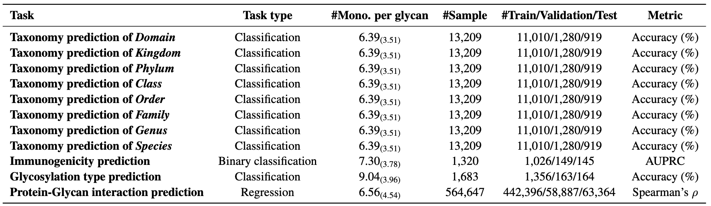

# GlycanML: A Multi-Task and Multi-Structure Benchmark for Glycan Machine Learning

This is the official codebase of the paper [GlycanML: A Multi-Task and Multi-Structure Benchmark for Glycan Machine Learning](https://arxiv.org/pdf/2405.16206).

[Minghao Xu](https://chrisallenming.github.io),
Yunteng Geng*,
Yihang Zhang*,
[Ling Yang](https://yangling0818.github.io),
[Jian Tang](https://jian-tang.com),
[Wentao Zhang](https://zwt233.github.io),
(*equal contribution)

## Overview ##

We build **GlycanML**, a comprehensive **multi-task** and **multi-structure** benchmark for Glycan Machine Learning. The GlycanML benchmark consists of diverse types of tasks including glycan taxonomy prediction, glycan immunogenicity prediction, glycosylation type prediction, and protein-glycan interaction prediction. Glycans can be represented by both sequences and graphs in GlycanML, which enables us to extensively evaluate sequence-based models and graph neural networks (GNNs) on benchmark tasks under both **single-task learning** and **multi-task learning** settings. 



This codebase is based on PyTorch and [TorchDrug], a powerful and flexible machine learning platform for drug modeling.
It supports training and inference with multiple GPUs or multiple machines.

[TorchDrug]: https://torchdrug.ai/

## Installation ##

You may install the dependencies of TorchDrug as below. 
Generally, they work with Python 3.8/3.9 and PyTorch version >= 1.8.0.

```bash
conda create -n torchdrug python=3.9
conda activate torchdrug

conda install --yes pytorch==1.12.1 torchvision==0.13.1 torchaudio==0.12.1 cudatoolkit=11.3 -c pytorch
conda install --yes pyg pytorch-scatter pytorch-cluster -c pyg
pip install torchdrug
pip install pyyaml easydict scipy fair-esm
pip install dill biopandas biopython e3nn wandb tensorboard tensorboardX
pip install glycowork[draw]
```

## Model Training ##

### Experimental Configurations

We provide a yaml based config for each benchmark experiment in our paper. 
The configs of all baselines for single-task and multi-task learning are stored in ```./config/``` with the following folder structure:

```
config
 └── single_task
     ├── CNN
     ├── ResNet
     ├── LSTM
     ├── BERT
     ├── GCN
     ├── RGCN
     ├── GAT
     ├── GIN
     ├── CompGCN
     ├── MPNN
 ├── multi_task
     ├── CNN
     ├── ResNet
     ├── LSTM
     ├── BERT
     ├── GCN
     ├── RGCN
     ├── GAT
     ├── GIN
     ├── CompGCN
     ├── MPNN
```

### Single-Task Learning ###

**Single-GPU.** By setting gpus: `[0]`, the experiment is performed under a single GPU. 
You can use the following command to run with seed 0:

```bash
python scripts/run_single.py --config ./configs/single_task/$model/$yaml_config \
    --gpus [0] --seed 0
```

**Multi-GPU.** By setting gpus: `[0,1,2,3]`, the experiment is performed under 4 GPUs of a node. 
You can use the following command to run with seed 0:

```bash
python -m torch.distributed.launch --nproc_per_node=4 scripts/run_single.py \
    --config ./configs/single_task/$model/$yaml_config --gpus [0,1,2,3] --seed 0
```

### Multi-Task Learning ###

**Single-GPU.** By setting gpus: `[0]`, the experiment is performed under a single GPU. 
You can use the following command to run with seed 0:

```bash
python scripts/run_single.py --config ./configs/multi_task/$model/$yaml_config \
    --gpus [0] --seed 0
```

**Multi-GPU.** By setting gpus: `[0,1,2,3]`, the experiment is performed under 4 GPUs of a node. 
You can use the following command to run with seed 0:

```bash
python -m torch.distributed.launch --nproc_per_node=4 scripts/run_single.py \
    --config ./configs/multi_task/$model/$yaml_config --gpus [0,1,2,3] --seed 0
```


## Benchmark Results ##

At the [website of GlycanML], we maintain a leaderboard for each benchmark task. 
We also maintain an **integrated leaderboard** among different methods by taking the mean reciprocal rank (MRR) as the metric. 
In the future, we will open the entrance to receive new benchmark results of new methods from the community. 

[website of GlycanML]: https://glycanml.github.io/project/

## License ##

This codebase is released under the Apache License 2.0 as in the [LICENSE](LICENSE) file.

## Citation ##
If you find this codebase helpful in your research, please cite the following paper.
```
@article{xu2024glycanml,
  title={GlycanML: A Multi-Task and Multi-Structure Benchmark for Glycan Machine Learning}, 
  author={Minghao Xu and Yunteng Geng and Yihang Zhang and Ling Yang and Jian Tang and Wentao Zhang},
  journal={arXiv preprint arXiv:2405.16206},
  year={2024},
}
```